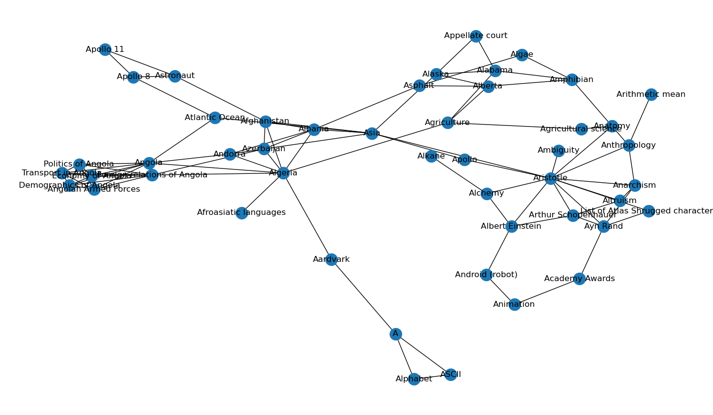

# Wikipedia_Graph
A knowledge representation graph based on Wikipedia

## How it works
In network_graph.py you can view a graphical representation of the network graph like the following

In path_finder.py you can let find the shortest connection between two topics.
